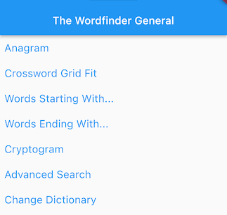
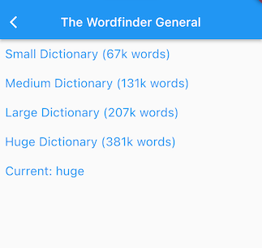
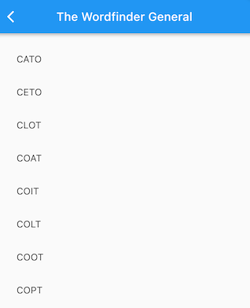
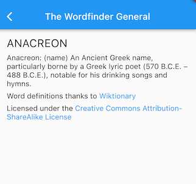
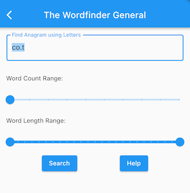
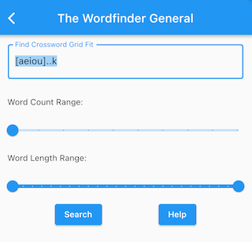
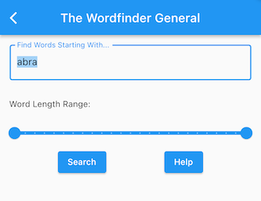
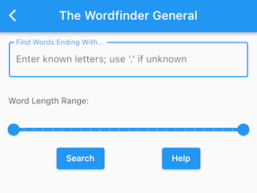
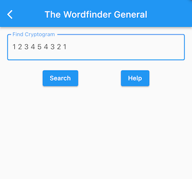
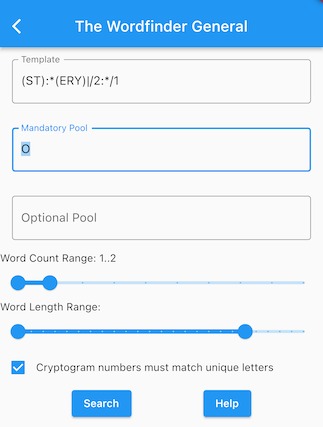

# WordFinder General User Guide

## Main Screen

From the main screen you can pick a search type, or go to the dictionary
selector to change the dictionary being used.

After running a search, the results will be shown in a scrollable list:

You can click on a word in the list to see its defintion:

## Anagram Search

Enter the letters that should be used to create the anagram. You
can use '.' for a wild-card letter; for example, entering 'co.t'
will find four-letter anagrams using the letters 'c', 'o', 't' and 
any other single character (assuming you haven't used the word length 
sliders to change the allowed result lengths).

It's also possible to use letter ranges like '\[aeiou\]` (for more details on
letter ranges, see the advanced search help).

For a multi-word anagram you can indicate the position of the word split
using '|' or ','. For example, 'co,.t' would find pairs of two-letter
words made from the letters 'c', 'o', 't', and one other.

Alternatively you can adjust the word count range slider to be
other than one for minimum or maximum number of words. If you do use
explicit word split characters '|' or ',' then the range slider will
be ignored.

You can use the word length sliders to set the minimum and maximum allowed
word lengths for results. These are by default set to min 1 and max 25, so
don't constrain anything (as the dictionaries contain words from one up to
25 characters long).

### (Advanced): Relationship to Advanced Search

Under the hood, anagram searches use the advanced search engine. A template is 
created by changing each letter to '.', and then the original letters are all 
placed in the 'must use' pool.

## Crossword Search

Crossword searches are useful when you known the
length of a word and the characters in some of the
positions. Enter the letters you know, and use '.'
for the ones you don't. For example, to find 4-letter
words that start with 'C' and end with 'T' you can 
enter 'c..t'.

It's also possible to use letter ranges (for more details on
letter ranges, see the advanced search help). For example, to
find 4-letter words that start with a vowel and end with 'k',
you could use '\[aeiou\]..k'.

You can match multi-word results by using '|' or ',' at the 
word boundary.

Alternatively you can use the word count range
sliders to do multi-word matches if you don't care about
the actual split point. Note that these sliders are ignored if you
have used ',' or '|' in the letters.

You can use the word length sliders to set the minimum and maximum allowed
word lengths for results. These are by default set to min 1 and max 25, so
don't constrain anything (as the dictionaries contain words from one up to
25 characters long).

### (Advanced): Relationship to Advanced Search

Under the hood, crossword searches use the advanced search engine, by converting all
letters to upper case, converting '.' to ':', and then using the result as the template,
with an empty 'must use' pool and an unlimited 'can use' pool.

## Prefix Search

Prefix search finds words that start with a specific prefix.
For example, if you enter 'cat' as your prefix, we will find
all words that start with 'cat'.

You can include '.' in your prefix constraint if the letter 
is not fixed. For example, to find words that start with 'c' 
where the third letter is 't', you can use the prefix 'c.t'.

It's also possible to use letter ranges (for more details on
letter ranges, see the advanced search help). For example, to
find words that start with two vowels, you could use prefix
'\[aeiou\]\[aeiou\]'.

You can use the word length range sliders to constrain the length
of the matching words (but note that the full prefix must be matched,
so if you set the max allowed word length to shorter than the prefix
length no matches will be found).

### (Advanced): Relationship to Advanced Search

Prefix Search is really just a convenient shortcut that 
simplifies things for users. In practice, it amounts to the
equivalent advanced search where '.*' is appended to the prefix
string, the must-use pool is empty, and the can-use pool is '.*'
(i.e. there are no pool constraints).

## Suffix Search

Suffix search finds words that end with a specific suffix.
For example, if you enter 'cat' as your suffix, we will find
all words that end with 'cat'.

You can include '.' in your suffix constraint if the letter 
is not fixed. For example, to find words that end with 't' 
where the third-last letter is 'c', you can use the suffix 'c.t'.

It's also possible to use letter ranges (for more details on
letter ranges, see the advanced search help). For example, to
find words that end with two vowels, you could use suffix
'\[aeiou\]\[aeiou\]'.

You can use the word length range sliders to constrain the length
of the matching words (but note that the full suffix must be matched,
so if you set the max allowed word length to shorter than the suffix
length no matches will be found).

### (Advanced): Relationship to Advanced Search

Suffix Search is really just a convenient shortcut that 
simplifies things for users. In practice, it amounts to the
equivalent advanced search where '.*' is prepended to the suffix
string, the must-use pool is empty, and the can-use pool is '.*'
(i.e. there are no pool constraints).

## Cryptogram Search

For cryptogram searches, any letter can instead be represented by a number; 
all letters with such restrictions and the same number must match the same 
letter. Furthermore, the associations of letters and numbers must be unique; 
you can't have a latter match more than one number (to do that, you need to 
use the Advanced Search).

For example, to find all six-letter palindromes you can use '1 2 3 3 2 1'. 
You can still use letters so to restrict the above to 6-letter palindromes
starting with A you can use 'A 1 2 2 1 A'.

More powerful versions of cryptogram searches are possible using the advanced search function.

### (Advanced): Relationship to Advanced Search

The cryptogram search functionality is a convenience; under the hood it uses the advanced search engine and instead of separating the options with spaces, uses ':' in front of each number, with an unlimited 'can use' pool and empty 'must use' pool. Our example above would be converted to the template 'A:1:2:2:1A'.

## Advanced Search

Underlying all of the Wordfinder General's searches is the advanced search engine.
Learning to use advanced search will give you the most power over finding word matches. If you are familiar at all with [regular expressions](https://en.wikipedia.org/wiki/Regular_expression) you should find much of the below quite familiar but there are some differences; the WordFinder General's regular expression is custom-built for 
match problems typical in word puzzles.

The basic concept is not too difficult: we try to find words that match a 
regular-expression-like template, using only letters drawn from one of two pools: 
a pool of letters that *must all* be used (the *mandatory pool*) and a pool of letters that 
*may optionally* be used (the *optional pool*). The template itself may contain some pre-populated 
letters already, so only some positions need to be completed from the pools.

To specify the template:

- Upper-case letters represent themselves, and don't come from the pools; ':' represents any single letter (A through Z), not from the pools
- Lower-case letters represent themselves, but must come from the pools (you may wonder why we would include these in the template, but that will become clear below when we discuss letter ranges); '.' represents any single letter (A through Z) that must come from one of the two letter pools
- | or , is used to separate words
- A subsequence of letters can be surrounded by parentheses. You can refer to a prior sequence with /1, /2, etc. So 'B(AN)/1A' is the same as 'BANANA'.
- any letter specifier can be followed by a number which is a *cryptogram* restriction. All letters with such restrictions and the same number must match the same letter. For example, to find all six-letter palindromes you can use ':1:2:3:3:2:1'.

Instead of letters, you can use letter ranges, surrounded by square brackets. For example:

- \[AEIOU\] - represents any single vowel, not from the pools
- \[abcde\] - represents one of the letters A, B, C, D or E, that must come from a pool
- \[a-e\] - is the same as \[abcde\]
- \[^AEIOU\] - ^ inverts a range, so this represents a consonant

Once again, upper-case letters in the template don't come from the pools; only lower case letters/ranges and '.'.
This means you can't mix and match pool and non-pool letters in a letter range; to address this we
use the convention that the case of the first letter in a range in the template determines the usage;
thus '\[Abc\]' is equivalent to '\[ABC\]' and '\[aBC\]' is equivalent to '\[abc\]'.

A letter or letter range usually represents a single letter, but that can be modified by following the latter or letter range with a *count specifier*:

- \+ means one or more
- \* means zero or more
- ? means 0 or 1
- @n means n (e.g. 'O@3' is the same as 'OOO')

Many of the same conventions for specifying letters can be used in the pools, although letter case has no meaning and
is ignored. The pools can include literal letters, letter ranges, '.' (or ':'; both are treated as equivalent to '\[A-Z\]'), and count specifiers. Apart from letter case being significant, another difference between the template and pools is that in the template, order is important, but in the pools it is not.

You can use the cryptogram restrictions in the template to place alphabetical position constraints on letter
matches by using '+' or '-' for simple 'additions' and 'subtractions'. For example, to find all three-letter words where the letters are adjacent to each other alphabetically but in reverse order you can use ':1:1-1:1-2'.

As another example, this comes from NPR's Sunday Puzzle: Think of a five-letter word. Change the first letter to the next letter of the alphabet, and you'll get a new word that doesn't share any sounds with the first one. Then change its first letter to the next letter of the alphabet, and you'll get a third word that doesn't share any sounds with either of the first two. What words are these?

We can find candidates for this puzzle with the pattern ':1:2:3:4:5|:1+1:2:3:4:5|:1+2:2:3:4:5'.
That pattern says we are looking for 3 5-letter words where all the letters are the same except
for the first letter; in that case the first letter of the second word comes on position later in the alphabet than that of the first word, and the first letter of the third word comes two positions later.

You can use the word length sliders to set the minimum and maximum allowed
word lengths for results. These are by default set to min 1 and max 25, so
don't constrain anything (as the dictionaries contain words from one up to
25 characters long).
